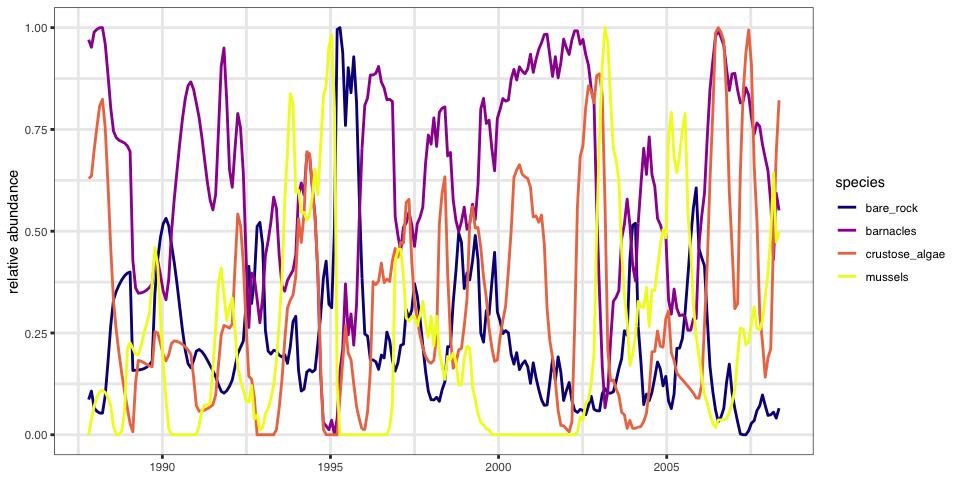
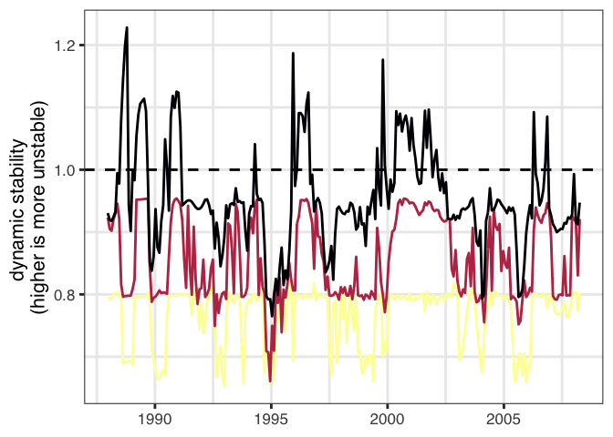
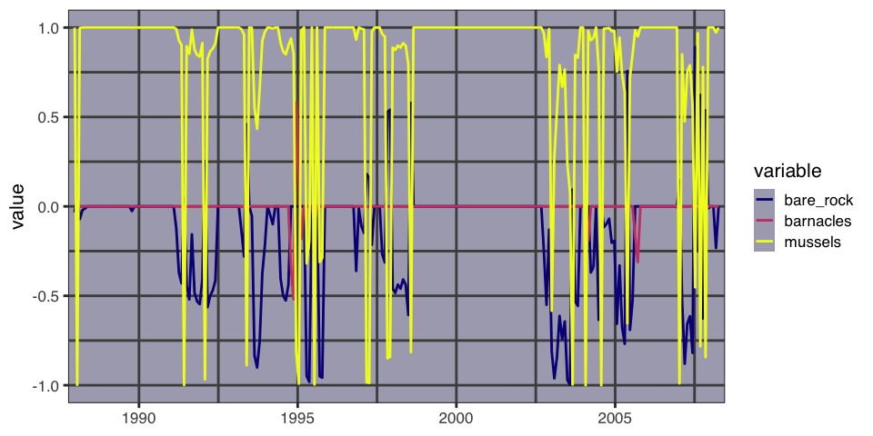
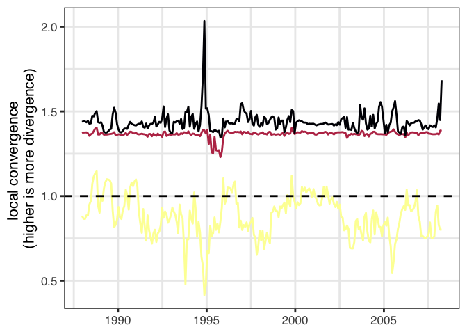
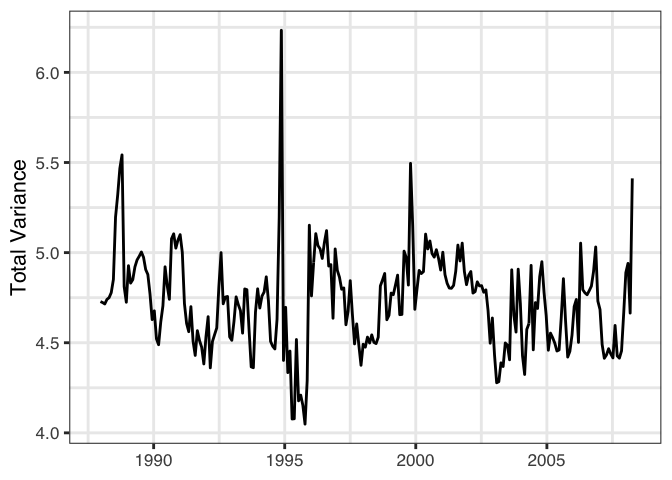

Rocky Intertidal Dynamic Stability Analysis
================
Hao Ye
2019-11-14

# Introduction

This report documents applying the dynamic stability analysis to the
rocky intertidal system reported on in (Benincà et al. 2015)

First, some setup for the environment:

``` r
library(portalDS)
library(dplyr)
library(ggplot2)

set.seed(42)
knitr::opts_chunk$set(
  collapse = TRUE,
  comment = "#>"
)
```

# Workflow

## Data

We use the interpolated data, as these methods also require regular
sampling in
time.

``` r
block <- readxl::read_excel(here::here("inst/extdata/pnas.1421968112.sd01.xlsx"), 
                            sheet = 2, 
                            col_types = c("text", "numeric", "numeric", "numeric", "numeric", "guess", "guess", "guess")) %>%
  mutate(Date = as.Date(as.numeric(Date) - 366, origin = "0000-12-31")) %>%
  select(1:5)
#> New names:
#> * `` -> ...6
#> * `` -> ...7
#> * `` -> ...8
names(block) <- c("date", "barnacles", "crustose_algae", "mussels", "bare_rock")
```

## Analysis

We do not go through the full analysis here. Instead, see the [Maizuru
Dynamic Stability
vignette](https://ha0ye.github.io/portalDS/articles/maizuru-dynamic-stability.html)
or (eventual methdos write-up).

``` r
results_file <- here::here("output/rocky_intertidal_ds_results.RDS")
results <- compute_dynamic_stability(block, results_file, id_var = "date")
str(results, max.level = 1)
#> List of 11
#>  $ block             :Classes 'tbl_df', 'tbl' and 'data.frame':  251 obs. of  5 variables:
#>  $ simplex_results   :Classes 'tbl_df', 'tbl' and 'data.frame':  4 obs. of  5 variables:
#>  $ ccm_results       :'data.frame':  32160 obs. of  9 variables:
#>  $ ccm_links         :Classes 'tbl_df', 'tbl' and 'data.frame':  6 obs. of  5 variables:
#>  $ smap_coeffs       :List of 4
#>  $ smap_matrices     :List of 251
#>  $ eigenvalues       :List of 251
#>  $ eigenvectors      :List of 251
#>  $ svd_decomp        :List of 3
#>  $ volume_contraction: Named num [1:251] NA NA 1.74 1.72 1.71 ...
#>   ..- attr(*, "names")= chr [1:251] "1987-10-23" "1987-11-22" "1987-12-22" "1988-01-21" ...
#>  $ total_variance    : Named num [1:251] NA NA 4.73 4.72 4.72 ...
#>   ..- attr(*, "names")= chr [1:251] "1987-10-23" "1987-11-22" "1987-12-22" "1988-01-21" ...
```

# Results

## Abundance time series

``` r
plot_time_series(results$block, time_column = "date")
```

<!-- -->

## Eigenvalues & Eigenvectors

``` r
plot_eigenvalues(results$eigenvalues, 
                 num_values = 3)
```

<!-- -->

``` r
plot_eigenvectors(results$eigenvectors)
```

<!-- -->

## Singular values and SVD vectors

``` r
plot_svd_values(results$svd_decomp$d, 
                num_values = 3)
```

<!-- -->

``` r
plot_svd_vectors(results$svd_decomp$u)
```

<!-- -->

## Volume contraction and total variance

``` r
plot_volume_contraction(results$volume_contraction)
#> Warning: Removed 3 rows containing missing values (geom_path).
```

<!-- -->

``` r
plot_total_variance(results$total_variance)
#> Warning: Removed 3 rows containing missing values (geom_path).
```

<!-- -->

# References

<div id="refs" class="references">

<div id="ref-Beninca_2015">

Benincà, Elisa, Bill Ballantine, Stephen P. Ellner, and Jef Huisman.
2015. “Species Fluctuations Sustained by a Cyclic Succession at the Edge
of Chaos.” *Proceedings of the National Academy of Sciences* 112 (20).
Proceedings of the National Academy of Sciences: 6389–94.
<https://doi.org/10.1073/pnas.1421968112>.

</div>

</div>
