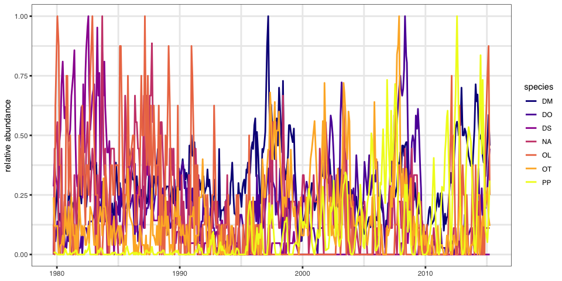
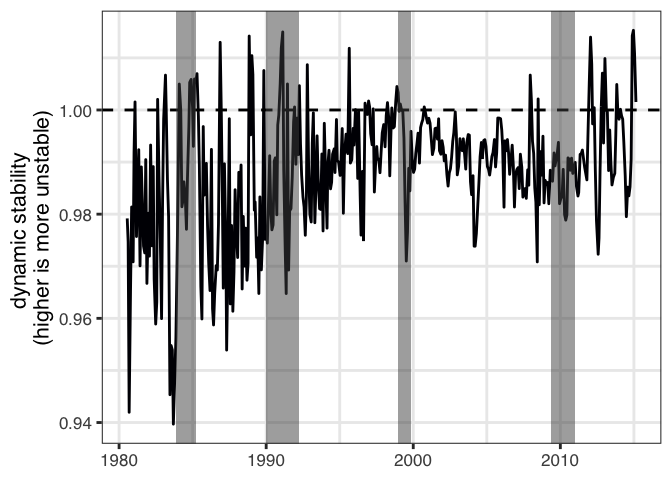
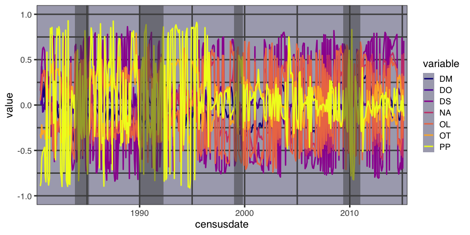
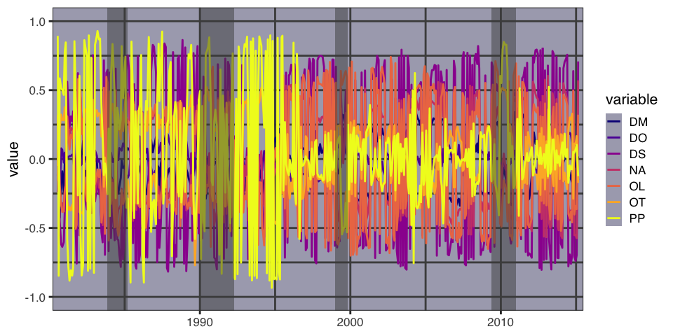
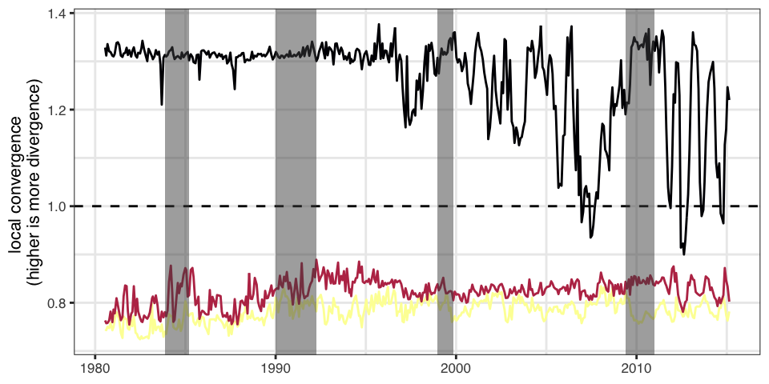

Portal Dynamic Stability Analysis
================
Hao Ye
2019-11-05

# Introduction

This report documents applying the dynamic stability analysis to the
Portal dataset.

First, some setup for the environment:

``` r
library(portalDS)
library(dplyr)
library(ggplot2)

set.seed(42)
knitr::opts_chunk$set(
  collapse = TRUE,
  comment = "#>",
  fig_width = 7
)
```

# Workflow

## Data

We use data from the 8 control plots, up to the 2015 treatment-switch.
Abundances are summed, and scaled according to the number of plots
sampled in each census (sometimes, incomplete sampling occurred). Only
species with at least 50% non-zero abundance across the time series were
kept. Missing censuses had abundances imputed using linear interpolation
for each individual species.

``` r
block <- make_portal_block(filter_q = 0.5)
#> Loading in data version 1.132.0
str(block)
#> Classes 'tbl_df', 'tbl' and 'data.frame':    440 obs. of  8 variables:
#>  $ censusdate: Date, format: "1979-09-22" "1979-10-24" ...
#>  $ DM        : num  10 10 14 18 22 12 14 12 11 14 ...
#>  $ DO        : num  0 4 2 3.5 5 3 1 2 3 5 ...
#>  $ DS        : num  6 8 7 6.5 6 5 10 11 15 17 ...
#>  $ NA        : num  0 4 4 4.5 5 1 1 0 4 0 ...
#>  $ OL        : num  1 0 5 6.5 8 7 3 3 2 1 ...
#>  $ OT        : num  6 3 3 3 3 0 0 1 1 2 ...
#>  $ PP        : num  1 1 1 0.5 0 0 0 0 0 0 ...
```

## Analysis

We do not go through the full analysis here. Instead, see the [Maizuru
Dynamic Stability
vignette](https://ha0ye.github.io/portalDS/articles/maizuru-dynamic-stability.html)
or (eventual methdos write-up).

We specify a results file for storing the outputs of the analysis. The
`compute_dynamic_stability()` function will check for the presence of
individual output components and will skip them if they’ve already been
computed.

``` r
results_file <- here::here("output/portal_ds_results_50.RDS")
results <- compute_dynamic_stability(block, results_file)
str(results, max.level = 1)
#> List of 8
#>  $ block          :Classes 'tbl_df', 'tbl' and 'data.frame': 440 obs. of  8 variables:
#>  $ simplex_results:Classes 'tbl_df', 'tbl' and 'data.frame': 7 obs. of  5 variables:
#>  $ ccm_results    :'data.frame': 88641 obs. of  9 variables:
#>  $ smap_matrices  :List of 440
#>  $ ccm_links      :Classes 'tbl_df', 'tbl' and 'data.frame': 35 obs. of  5 variables:
#>  $ svd_decomp     :List of 3
#>  $ eigenvalues    :List of 440
#>  $ eigenvectors   :List of 440
```

# Results

## Abundance time series

``` r
plot_time_series(results$block)
```

<!-- -->

## Eigenvalues & Eigenvectors

Highlighted segments are the posterior estimates of regime shifts from
Christensen et al. 2018.

``` r
plot_eigenvalues(results$eigenvalues) %>% 
    add_regime_shift_highlight()
```

<!-- -->

``` r
plot_eigenvectors(results$eigenvectors) %>% 
    add_regime_shift_highlight()
```

<!-- -->

## Singular values and SVD vectors

Again, highlighted segments are the posterior estimates of regime shifts
from Christensen et al. 2018.

``` r
plot_svd_values(results$svd_decomp$d) %>% 
    add_regime_shift_highlight()
```

<!-- -->

``` r
plot_svd_vectors(results$svd_decomp$u) %>% 
    add_regime_shift_highlight()
```

<!-- -->
